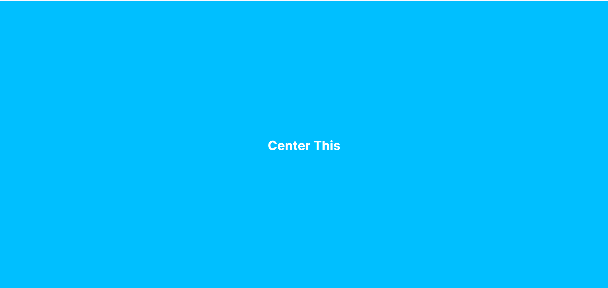
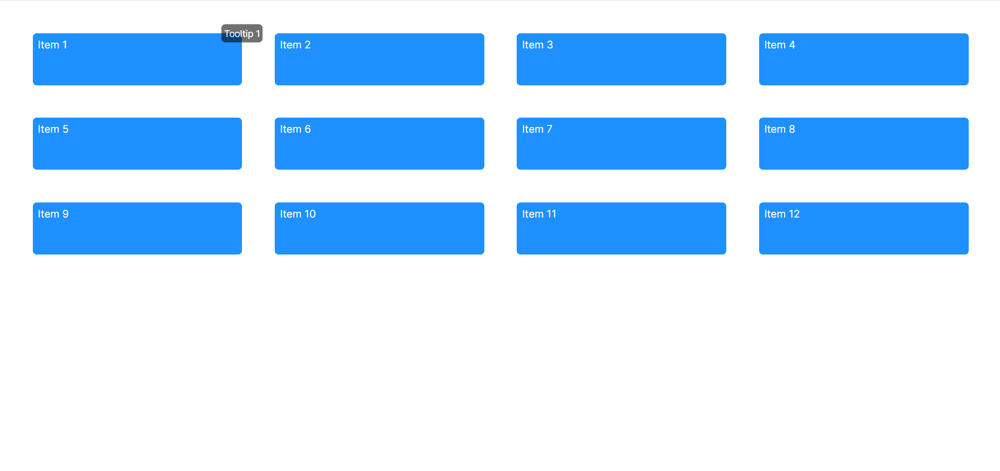
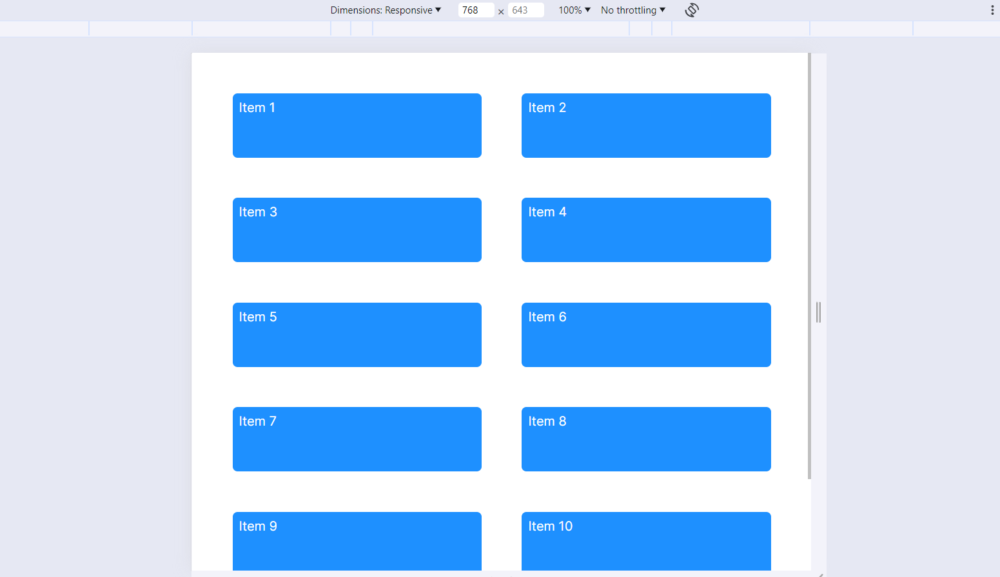
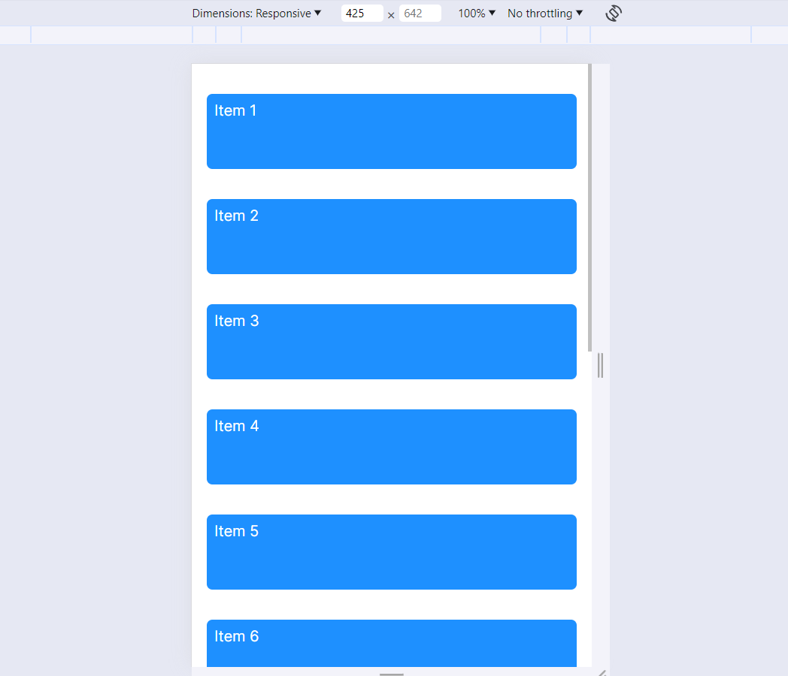
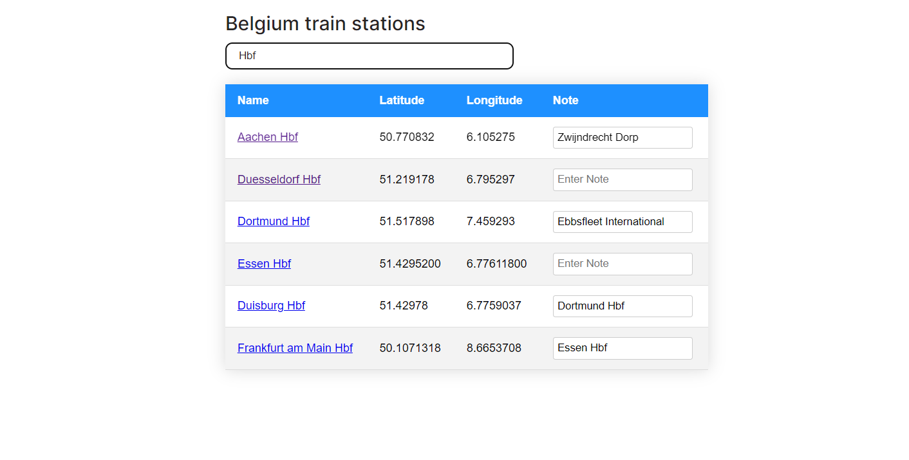

# Inxtest Assignment Frontend (Next.js + Typescript)

## Installation

```bash
$ npm install
```
## Getting Started

First, run the development server:

```bash
$ npm run dev
```
Open [http://localhost:3000](http://localhost:3000) with your browser to see the result.

#### GIT HTTPS ACCESS
```bash
https://github.com/Nishh78/inxtest-assignment.git
```

## Features
1. Exercises One - Center a DIV:

 

    - Using Flexbox
    - Grid Property
    - Absolute Property

2. Exercise Two - Table layout:


  
  

    - Responsive table layout with hover tooltip
3. Exercise Three - Javascript:

  

    - Dynamically data ( API call)
    - Data-grid
    - Searching, Google Map Link etc. 
